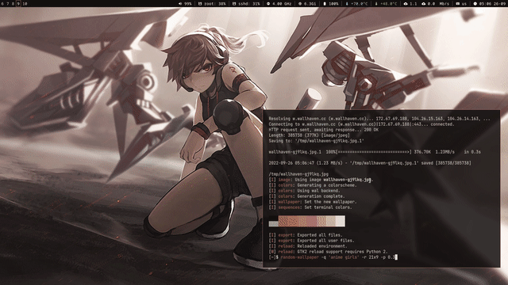

# 🖼 random-wallpaper
Random wallpaper from wallhaven.cc on bash

## ✨ Preview


## 🧨 Usage

```sh
Usage: random-wallpaper [options] [arguments]

 -q QUERY	 Search wallpaper:
 		 e.g sky or 'purple sky'

 -r RATIO	 set ratio:
 		 16x9, 16x10, 21x9

 -s SIZE	 Size of wallpaper:
 		 1920x1080

 -p SATURATE	 use pywal and set saturate:
 		 0.0 - 1.0

 -v		 Verbose
 -h		 Help
```

## 📦 Dependencies
- curl
- bash
- feh
- wget
- grep
- echo
- pywal

## 🛠 Contributing

If you want to contribute anything. You’re welcome to do pull-requests.

## 📜 License

random-wallpaper is [GNU General Public License v3.0 licensed](./LICENSE)


